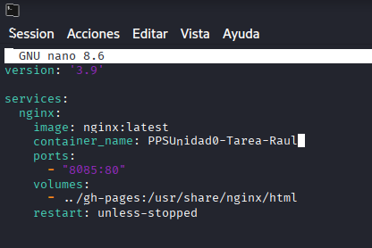
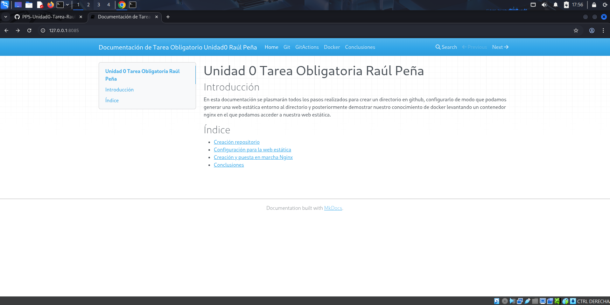

# Docker nginx con la web estática

En este último apartado vamos a crear un contenedor de docker. La idea es que el contenedor que estará basado en la imagen de nginx muestre la web estática creada a partir de nuestro repositorio de git.

## Creación  del contenedor

Antes de crear el contenedor tenemos que tener en cuenta que los archivos de la web estática se encuentran en la rama gh-pages de nuestro repositorio, información muy útil que nos ayudará a la hora de crear el volumen del contenedor con
`Bind-mount`.

Este contenedor que vamos a crear debe tener las siguientes características:

- El nombre del contenedor será PPSUnidad0-Tarea-Minombre.
- Debemos redirigir el puerto que muestra la web nginx al puerto 8085 de nuestra máquina.
- Usaremos un `bind-mount` para unir la carpeta de nuestro repositorio.

Una vez tenemos esto claro debemos elegir un método para crear el contenedor, en mi caso voy a levantarlo con un docker-compose.yml, el cual tiene la siguiente estructura:



En este docker composo se muestra lo primero la version, la cual hemos definido como la 3.9 y después debemos definir los servicios del contenedor:

1. El contenedor desplegará un servicio nginx basado en la imagen nginx:latest, la última versión.
1. Definimos el nombre del contenedor.
1. Especifcamos el puerto al cual vamos a redirigir el servicio en nuestra máquina anfitriona.
1. Definimos el volumen del contenedor. En este caso será un `bind-mount` que unirá la carpeta gh-pages del repositorio git con el directorio donde nginx guarda los archivos de la web.
1. Por último hemos especificado la opción para que se reinicie cuando se produzca un error.

**IMPORTANTE**: hay que tener en cuenta que puede que no exista el directorio ../gh-pages o este vacío para ello debemos situarnos en la rama `gh-pages` y crear el directorio además de copiar los archivos de la rama en este directorio
con los siguientes comandos:
```
mkdir -p ../gh-pages
sudo cp -R * ../gh-pages
```

Con estos comandos abremos copiado la web estática en la carpeta hemos especificado el bind-mount de nuestro contenedor de docker.

## Muestra del contenedor

Una vez tengamos nuestro docker-compose.yml creado, en mi caso esta en la rama main de mi repositorio de git, nos dirigiremos a dicha rama y ejecutamos el comando `docker compose up -d` para levantar el contenedor como demonio.

Con el contenedor en ejecución podemos acceder a la dirección 127.0.0.1:8085 donde hemos redirigido la página nginx en nuestra máquina local y se nos mostrará la página de github.io:

Y ya tendríamos el contenedor creado y en ejecución, podemos ver el estado de este gracias al comando `docker inspect`, como se muestra en la siguiente imagen:

Para parar el contenedor simplemente tenemos que ejecutar el comando `docker compose down`.
