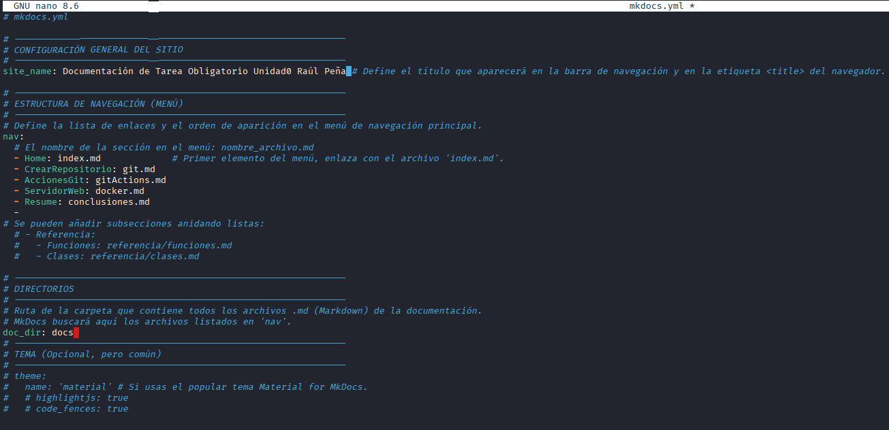
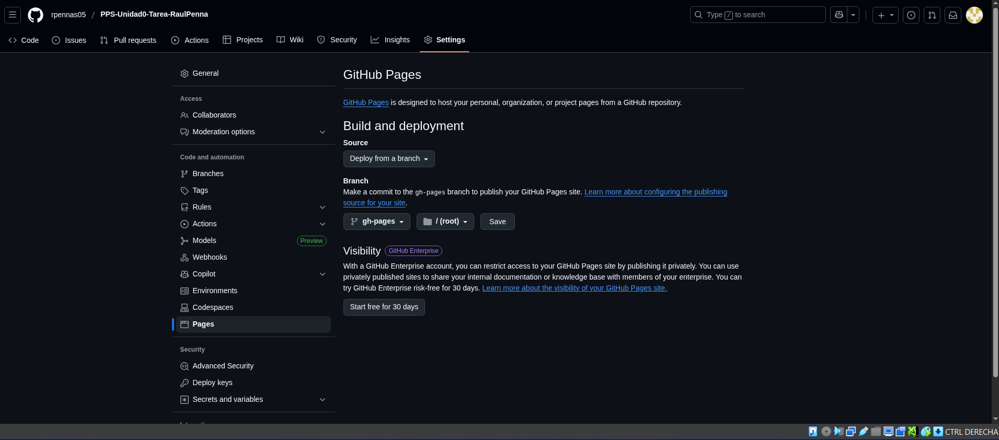

# Creación de la web estática

En estos apartados se mostrará como hemos creado la infraestructura de la web estática basada en nuestro repositorio de git, así como los pasos para mostrar dicha web.

## Configuración MkDocs

Para configurar el mkdocs.yml, el cual tenemos creado gracias a clonar el repositorio de otra actividad, hemos accedido a este archivo el cual se muestra tal que así:

En nuestro mkdocs hemos configurado lo siguiente:

1. Site_name: esta es una variable u opción que define el nombre de la página, el que se muestra en la barra de pestañas abiertas.
1. nav: este es el navegador de nuestra web estática, el cual es una lista con las diferentes secciones de la web, cada sección se define con un guión el nombre de la sección y seguido enlazamos con el archivo markdown que muestra el
contenido de esa sección.
1. doc_dir: esta variable es en la que especificaremos la carpeta o el directorio donde se encuentran los archivos md que formarán la web estática.

## Mostrar la web estática

Una vez tenemos definido nuestro archivo mkdocs, para mostrar nuestra web debemos realizar la siguiente configuración:

- Dirigirnos a las settings del repositorio.
- En el apartado Pages seleccionamos la fuente `Deploy from a branch`.
- En el apartado branch seleccionamos la rama que contiene los archivos de la web, en nuestro caso gh-pages.
- Guardamos los cambios y al cabo de unos minutos nos aparecerá la sección Deployments en nuestro repositorio desde la cual podemos acceder a la web.

En la siguiente imagen se muestra mejor la configuración a realizar: 
